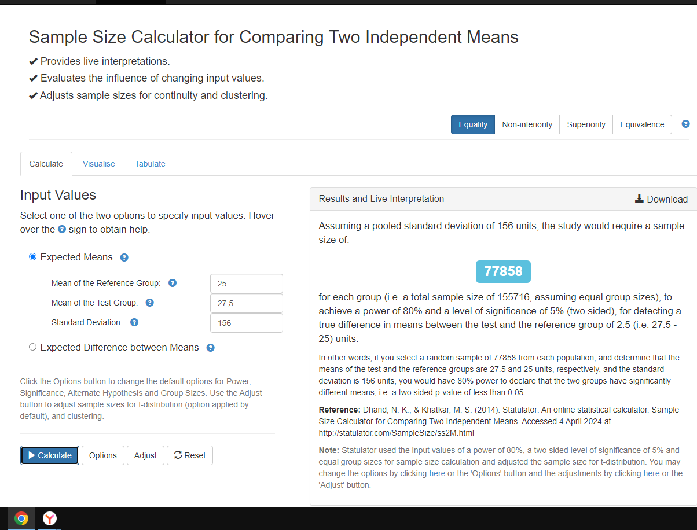
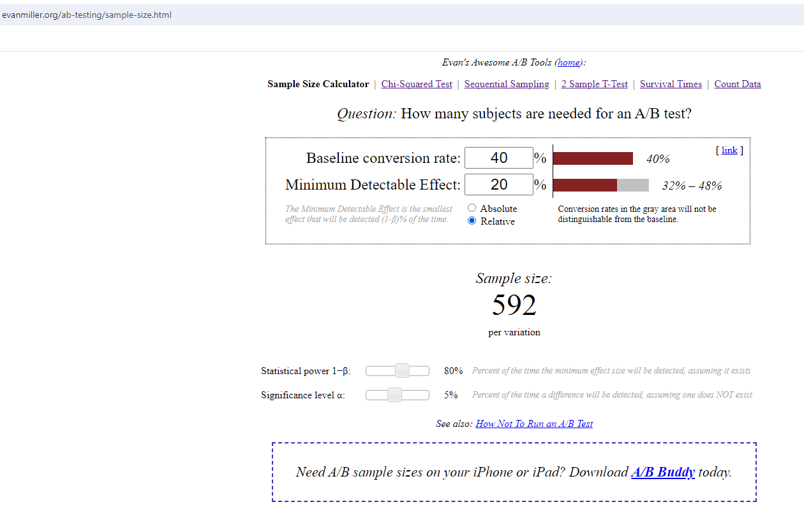

# A/B-тестирование

## Домашняя работа №6 "Расчёт длительности А/B теста + продвинутые топики"

## Задание 1. 

### Продакт на главной mail.ru решил протестировать в рекомендательной ленте контента вместо карточек со статьями видеоплеер с короткими видео. Нынешний таймспент на юзера в день в среднем равен 25 минут, а стандартная ошибка (SD) равна 156. Мы предполагаем, что в новой версии таймспент на юзера в день изменится на 10%. Средний трафик 20000 человек в день. Посчитайте сколько дней необходимо держать эксперимент при alpha = 5% и beta = 20%.  

### Решение:

### В новой версии среднее время таймспента юзера равно 25 * 10 / 100 = 27.5  

### При получившейся выборке размером 2 * 77858 = 155716, при трафике 20000 человек в день, количество дней для эксперимента равно 155716 / 20000 = 7.79 или примерно 8 дней. 

## Задание 2. 

### Наша продуктовая команда в ecommerce магазине планирует запустить тест, направленный на ускорение загрузки сайта. Одна из основных метрик bounce rate в GA = 40%. Мы предполагаем, что при оптимизации сайта она изменится минимум на 20%. Средний трафик 4000 человек в день. Посчитайте сколько нам нужно дней держать эксперимент при alpha = 5% и beta = 20%.

### Решение:

### При получившейся выборке размером 2 * 592 = 1184, при трафике в 4000 человек в день, количество дней для эксперимента равно 1184 / 4000 = 0.297 или примерно 1 день.